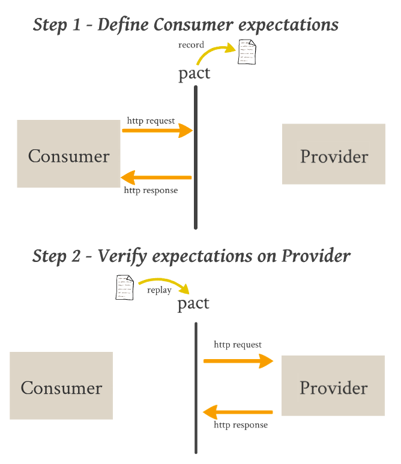
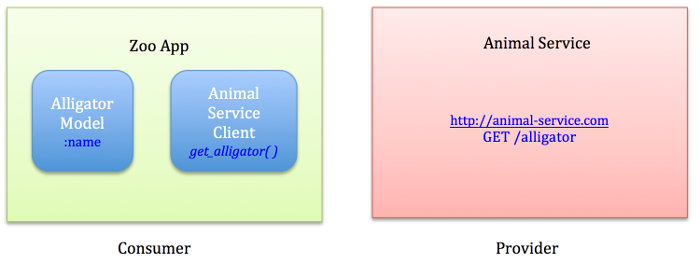

# Pact
[](https://travis-ci.org/pact-foundation/pact-ruby)
 [](#backers)
 [](#sponsors) 

Define a pact between service consumers and providers, enabling "consumer driven contract" testing.

Pact provides a fluent API for service consumers to define the HTTP requests they will make to a service provider and the HTTP responses they expect back. These expectations are used in the consumer specs to provide a mock service provider. The interactions are recorded, and played back in the service provider specs to ensure the service provider actually does provide the response the consumer expects.

This allows testing of both sides of an integration point using fast unit tests.

This gem is inspired by the concept of "Consumer driven contracts". See [this article](http://martinfowler.com/articles/consumerDrivenContracts.html) by Ian Robinson for more information.

## What is it good for?

Pact is most valuable for designing and testing integrations where you (or your team/organisation/partner organisation) control the development of both the consumer and the provider, and the requirements of the consumer are going to be used to drive the features of the provider. It is fantastic tool for developing and testing intra-organisation microservices.

## What is it not good for?

* Testing new or existing providers where the functionality is not being driven by the needs of the consumer (eg. public APIs)
* Testing providers where the consumer and provider teams do not have good communication channels.
* Performance and load testing.
* Functional testing of the provider - that is what the provider's own tests should do. Pact is about checking the contents and format of requests and responses.
* Situations where you cannot load data into the provider without using the API that you're actually testing (eg. public APIs). [Why?][pact-public-apis]
* Testing "pass through" APIs, where the provider merely passes on the request contents to a downstream service without validating them. [Why?][pass-through-apis]

## Features

* A service is mocked using an actual process running on a specified port, so javascript clients can be tested as easily as backend clients.
* "Provider states" (similar to fixtures) allow the same request to be made with a different expected response.
* Consumers specify only the fields they are interested in, allowing a provider to return more fields without breaking the pact. This allows a provider to have a different pact with a different consumer, and know which fields each cares about in a given response.
* RSpec and Minitest support for the service consumer codebase.
* Rake tasks allow pacts to be verified against a service provider codebase.
* Different versions of a consumer/provider pairs can be easily tested against each other, allowing confidence when deploying new versions of each (see the [pact_broker][pact_broker] and [pact_broker-client][pact_broker-client] gems).
* Autogenerated API documentation - need we say more?
* Autogenerated network diagrams with the [Pact Broker](https://github.com/pact-foundation/pact_broker)

## How does it work?

1. In the specs for the provider facing code in the consumer project, expectations are set up on a mock service provider.
1. When the specs are run, the mock service returns the expected responses. The requests, and their expected responses, are then written to a "pact" file.
1. The requests in the pact file are later replayed against the provider, and the actual responses are checked to make sure they match the expected responses.



## Why is developing and testing with Pact better than using traditional system integration tests?

* Faster execution.
* Reliable responses from mock service reduce likelihood of flakey tests.
* Causes of failure are easier to identify as only one component is being tested at a time.
* Design of service provider is improved by considering first how the data is actually going to be used, rather than how it is most easily retrieved and serialised.
* No separate integration environment required for automated integration tests - pact tests run in standalone CI builds.
* Integration flows that would traditionally require running multiple services at the same time can be broken down and each integration point tested separately.

## Getting help

* Pact docs: [docs.pact.io](http://docs.pact.io)
* Ruby Pact wiki: [github.com/pact-foundation/pact-ruby/wiki](https://github.com/pact-foundation/pact-ruby/wiki)
* Slack: <script async defer src="https://pact-slack.herokuapp.com/slackin.js?large"></script>
* Stackoverflow: [ruby pact questions](https://stackoverflow.com/questions/tagged/pact-ruby) or [general pact questions](https://stackoverflow.com/questions/tagged/pact)
* Twitter: [@pact_up](https://twitter.com/pact_up)

## Installation

Add this line to your application's Gemfile:

    gem 'pact'
    # gem 'pact-consumer-minitest' for minitest

And then execute:

    $ bundle

Or install it yourself as:

    $ gem install pact

## Usage - an example scenario

We're going to write an integration, with Pact tests, between a consumer, the Zoo App, and its provider, the Animal Service. In the Consumer project, we're going to need a model (the Alligator class) to represent the data returned from the Animal Service, and a client (the AnimalServiceClient) which will be responsible for making the HTTP calls to the Animal Service.



### In the Zoo App (consumer) project

#### 1. Start with your model

Imagine a model class that looks something like this. The attributes for a Alligator live on a remote server, and will need to be retrieved by an HTTP call to the Animal Service.

```ruby
class Alligator
  attr_reader :name

  def initialize name
    @name = name
  end

  def == other
    other.is_a?(Alligator) && other.name == name
  end
end
```

#### 2. Create a skeleton Animal Service client class

Imagine an Animal Service client class that looks something like this.

```ruby
require 'httparty'

class AnimalServiceClient
  include HTTParty
  base_uri 'http://animal-service.com'

  def get_alligator
    # Yet to be implemented because we're doing Test First Development...
  end
end
```
#### 3. Configure the mock Animal Service

The following code will create a mock service on localhost:1234 which will respond to your application's queries over HTTP as if it were the real "Animal Service" app. It also creates a mock provider object which you will use to set up your expectations. The method name to access the mock service provider will be what ever name you give as the service argument - in this case "animal_service"

```ruby
# In /spec/service_providers/pact_helper.rb

require 'pact/consumer/rspec'
# or require 'pact/consumer/minitest' if you are using Minitest

Pact.service_consumer "Zoo App" do
  has_pact_with "Animal Service" do
    mock_service :animal_service do
      port 1234
    end
  end
end
```

#### 4. Write a failing spec for the Animal Service client

```ruby
# In /spec/service_providers/animal_service_client_spec.rb

# When using RSpec, use the metadata `:pact => true` to include all the pact functionality in your spec.
# When using Minitest, include Pact::Consumer::Minitest in your spec.

describe AnimalServiceClient, :pact => true do

  before do
    # Configure your client to point to the stub service on localhost using the port you have specified
    AnimalServiceClient.base_uri 'localhost:1234'
  end

  subject { AnimalServiceClient.new }

  describe "get_alligator" do

    before do
      animal_service.given("an alligator exists").
        upon_receiving("a request for an alligator").
        with(method: :get, path: '/alligator', query: '').
        will_respond_with(
          status: 200,
          headers: {'Content-Type' => 'application/json'},
          body: {name: 'Betty'} )
    end

    it "returns a alligator" do
      expect(subject.get_alligator).to eq(Alligator.new('Betty'))
    end

  end

end
```

#### 5. Run the specs

Running the AnimalServiceClient spec will generate a pact file in the configured pact dir (`spec/pacts` by default).
Logs will be output to the configured log dir (`log` by default) that can be useful when diagnosing problems.

Of course, the above specs will fail because the Animal Service client method is not implemented, so next, implement your provider client methods.

#### 6. Implement the Animal Service client consumer methods

```ruby
class AnimalServiceClient
  include HTTParty
  base_uri 'http://animal-service.com'

  def get_alligator
    name = JSON.parse(self.class.get("/alligator").body)['name']
    Alligator.new(name)
  end
end
```

#### 7. Run the specs again.

Green! You now have a pact file that can be used to verify your expectations of the Animal Service provider project.

Now, rinse and repeat for other likely status codes that may be returned. For example, consider how you want your client to respond to a:
* 404 (return null, or raise an error?)
* 500 (specifying that the response body should contain an error message, and ensuring that your client logs that error message will make your life much easier when things go wrong)
* 401/403 if there is authorisation.

### In the Animal Service (provider) project

#### 1. Create the skeleton API classes

Create your API class using the framework of your choice (the Pact authors have a preference for [Webmachine][webmachine] and [Roar][roar]) - leave the methods unimplemented, we're doing Test First Develoment, remember?

#### 2. Tell your provider that it needs to honour the pact file you made earlier

Require "pact/tasks" in your Rakefile.

```ruby
# In Rakefile
require 'pact/tasks'
```

Create a `pact_helper.rb` in your service provider project. The recommended place is `spec/service_consumers/pact_helper.rb`.

See [Verifying Pacts](https://github.com/pact-foundation/pact-ruby/wiki/Verifying-pacts) and the [Provider](documentation/configuration.md#provider) section of the Configuration documentation for more information.

```ruby
# In spec/service_consumers/pact_helper.rb

require 'pact/provider/rspec'

Pact.service_provider "Animal Service" do

  honours_pact_with 'Zoo App' do

    # This example points to a local file, however, on a real project with a continuous
    # integration box, you would use a [Pact Broker](https://github.com/pact-foundation/pact_broker) or publish your pacts as artifacts,
    # and point the pact_uri to the pact published by the last successful build.

    pact_uri '../zoo-app/spec/pacts/zoo_app-animal_service.json'
  end
end
```

#### 3. Run your failing specs

    $ rake pact:verify

Congratulations! You now have a failing spec to develop against.

At this stage, you'll want to be able to run your specs one at a time while you implement each feature. At the bottom of the failed pact:verify output you will see the commands to rerun each failed interaction individually. A command to run just one interaction will look like this:

    $ rake pact:verify PACT_DESCRIPTION="a request for an alligator" PACT_PROVIDER_STATE="an alligator exists"

#### 4. Implement enough to make your first interaction spec pass

Rinse and repeat.

#### 5. Keep going til you're green

Yay! Your Animal Service provider now honours the pact it has with your Zoo App consumer. You can now have confidence that your consumer and provider will play nicely together.

### Using provider states

Each interaction in a pact is verified in isolation, with no context maintained from the previous interactions. So how do you test a request that requires data to already exist on the provider? Read about provider states [here](https://github.com/pact-foundation/pact-ruby/wiki/Provider-states).

## Configuration

See the [Configuration](/documentation/configuration.md) section of the documentation for options relating to thing like logging, diff formatting, and documentation generation.

## Pact best practices

As in all things, there are good ways to implement Pacts, and there are not so good ways. There are also some Pact [GOTCHAS][gotchas] to beware of! Check out the [Best practices](https://github.com/pact-foundation/pact-ruby/wiki/Best-practices) section of the documentation to make sure you're not Pacting it Wrong.

## Docs

* [Example](example)
* [Configuration](documentation/configuration.md)
* [Terminology](https://github.com/pact-foundation/pact-ruby/wiki/Terminology)
* [Provider States](https://github.com/pact-foundation/pact-ruby/wiki/Provider-states)
* [Verifying pacts](https://github.com/pact-foundation/pact-ruby/wiki/Verifying-pacts)
* [Sharing pacts between consumer and provider](https://github.com/pact-foundation/pact-ruby/wiki/Sharing-pacts-between-consumer-and-provider)
* [Regular expressions and type matching with Pact](https://github.com/pact-foundation/pact-ruby/wiki/Regular-expressions-and-type-matching-with-Pact)
* [Frequently asked questions](https://github.com/pact-foundation/pact-ruby/wiki/FAQ)
* [Rarely asked questions](https://github.com/pact-foundation/pact-ruby/wiki/RAQ)
* [Best practices](https://github.com/pact-foundation/pact-ruby/wiki/Best-practices)
* [Troubleshooting](https://github.com/pact-foundation/pact-ruby/wiki/Troubleshooting)
* [Testing with pact diagram](https://github.com/pact-foundation/pact-ruby/wiki/Testing with pact.png)
* [News, blogs and articles](https://github.com/pact-foundation/pact-ruby/wiki/News,-blogs-and-articles)

## Related libraries

[Pact Provider Proxy](https://github.com/pact-foundation/pact-provider-proxy) - Verify a pact against a running server, allowing you to use pacts with a provider of any language.

[Pact Broker](https://github.com/pact-foundation/pact_broker) - A pact repository. Provides endpoints to access published pacts, meaning you don't need to use messy CI URLs in your codebase. Enables cross testing of prod/head versions of your consumer and provider, allowing you to determine whether the head version of one is compatible with the production version of the other. Helps you to answer that ever so important question, "can I deploy without breaking all the things?"

[Pact Broker Client](https://github.com/pact-foundation/pact_broker-client) - Contains rake tasks for publishing pacts to the pact_broker.

[Shokkenki](https://github.com/brentsnook/shokkenki) - Another Consumer Driven Contract gem written by one of Pact's original authors, Brent Snook. Shokkenki allows matchers to be composed using jsonpath expressions and allows auto-generation of mock response values based on regular expressions.

[A list of Pact implementations in other languages](https://github.com/pact-foundation/pact-ruby/wiki#implementations-in-other-languages) - JVM, .Net, Javascript and Swift

## Links

[Simplifying microservices testing with pacts](http://dius.com.au/2014/05/20/simplifying-micro-service-testing-with-pacts/) - Ron Holshausen (one of the original pact authors)

[Pact specification](https://github.com/pact-foundation/pact-specification)

[Integrated tests are a scam](https://vimeo.com/80533536) - J.B. Rainsberger

[Consumer Driven Contracts](http://martinfowler.com/articles/consumerDrivenContracts.html) - Ian Robinson

[Integration Contract Tests](http://martinfowler.com/bliki/IntegrationContractTest.html) - Martin Fowler

## Roadmap

See [ROADMAP.md](/ROADMAP.md).

## Contributing

See [CONTRIBUTING.md](/CONTRIBUTING.md).

[webmachine]: https://github.com/webmachine/webmachine-ruby
[roar]: https://github.com/apotonick/roar
[pact_broker]: https://github.com/pact-foundation/pact_broker
[pact_broker-client]: https://github.com/pact-foundation/pact_broker-client
[pact-public-apis]: https://github.com/pact-foundation/pact-ruby/wiki/Why-Pact-may-not-be-the-best-tool-for-testing-public-APIs
[pass-through-apis]: https://github.com/pact-foundation/pact-ruby/wiki/Why-Pact-may-not-be-the-best-tool-for-testing-pass-through-APIs
[gotchas]: https://github.com/pact-foundation/pact-ruby/wiki/Matching-gotchas

## Contributors

This project exists thanks to all the people who contribute. [[Contribute](CONTRIBUTING.md)].
<a href="graphs/contributors"></a>


## Backers

Thank you to all our backers! 🙏 [[Become a backer](https://opencollective.com/pact-foundation#backer)]

<a href="https://opencollective.com/pact-foundation#backers" target="_blank"></a>


## Sponsors

Support this project by becoming a sponsor. Your logo will show up here with a link to your website. [[Become a sponsor](https://opencollective.com/pact-foundation#sponsor)]

<a href="https://opencollective.com/pact-foundation/sponsor/0/website" target="_blank"></a>
<a href="https://opencollective.com/pact-foundation/sponsor/1/website" target="_blank"></a>
<a href="https://opencollective.com/pact-foundation/sponsor/2/website" target="_blank"></a>
<a href="https://opencollective.com/pact-foundation/sponsor/3/website" target="_blank"></a>
<a href="https://opencollective.com/pact-foundation/sponsor/4/website" target="_blank"></a>
<a href="https://opencollective.com/pact-foundation/sponsor/5/website" target="_blank"></a>
<a href="https://opencollective.com/pact-foundation/sponsor/6/website" target="_blank"></a>
<a href="https://opencollective.com/pact-foundation/sponsor/7/website" target="_blank"></a>
<a href="https://opencollective.com/pact-foundation/sponsor/8/website" target="_blank"></a>
<a href="https://opencollective.com/pact-foundation/sponsor/9/website" target="_blank"></a>


