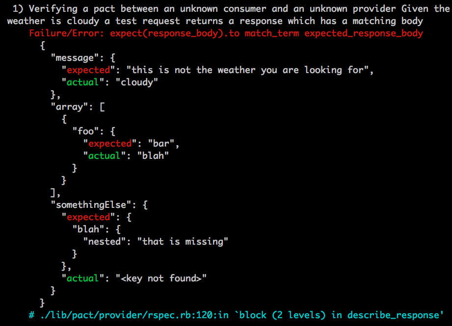
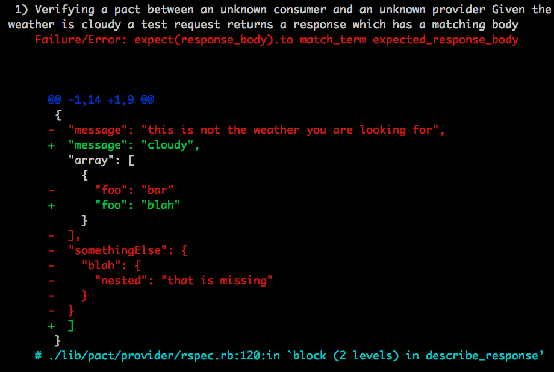

# Configuration

## Consumer and Provider

### diff_formatter

Default value: [:list](list)

Options: [:list](list), [:embedded](embedded), [:unix](unix) 

```ruby
Pact.configure do | config |
  config.diff_formatter = :list
end

```

#### :list


#### :embedded



#### :unix


## Consumer


## Provider
